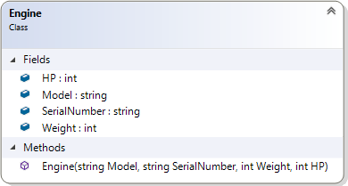
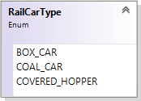
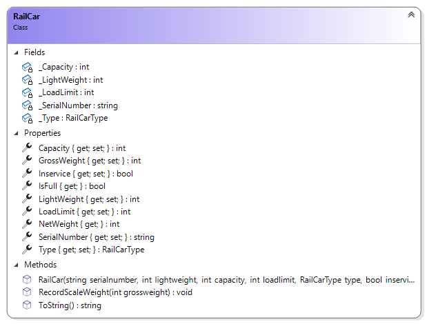
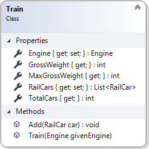

# OOP Training

> This is the first of a set of exercises that follow the evolution of a program to manage trains. This set is cumulative and will build upon previous exercises.

## Overview

Your task is to generate a set of simple data types to represent the primary objects for managing trains.

For this exercise, place all the required data types in the namespace `TrainSystem` and ensure that they are `public`. Create your project as a Console Application (.NET 5). You will need to code the driver for this exercise to demonstrate your objects can hold appropriate data.

### General Validation Rules

All validation is to be performed by throwing exceptions. Here are some general requirements.

- Exceptions must have meaningful error messages.
- Error messages must include details about the limits for acceptable values.
- Weights must always be positive and non-zero whole numbers. Weights are to be in 100 pound increments (all weights are in pounds).
- All string information must contain text. Null, empty, and plain white-space text is not allowed. Sanitize your strings by trimming the leading and trailing whitespace.

### The `Engine`

Engines are the workhorse of the railway system. For our purposes, we need to track the train engine's **Model** (e.g.: "CP 8002"), **Serial Number** (e.g.: "48807"), **Weight** (in pounds, e.g.: 147,700), and **Horse Power** (e.g.: 4400). 

All of this must be stored as read-only information (it cannot be modified). Use private fields and properties with private sets. You will need a greedy constructor for this class. Create an overloaded .ToString() method for the class to display all the instance values in a comma separated value string.

Note the following:

- Horse Power must be a positive whole number between 3500 and 5500. HP is measured in 100 HP increments.

### The `RailCarType`

Railcars come in various types. Initially, we will consider only three types of railcars: box cars, coal cars, and covered hoppers.

### The `RailCar`

Railcars carry various kinds of goods. Each railcar is stenciled with certain information:

- **Serial Number** (e.g.: "18172") - Uniquely identifies a specific car; may include characters and digits in the number.
- **Light Weight** (in pounds) - The weight of the railcar when empty.
- **Capacity** (in pounds) - Standard maximum Net Weight. This is the "ballpark" figure used when loading a railcar. The actual scale weight may be slightly higher or lower for what is considered a "full" load.
- **Load Limit** (in pounds) - Absolute maximum Net Weight allowed for safety purposes. This does not include the Light Weight. Exceeding this weight makes the railcar unsafe.

Each railcar is designed to carry a  specific type of cargo and is tracked as to being in service or out of service:

- **Type** - Value that represents the type of this car.
- **InService** - Value that represents the activity status of this car.

Railcars can be loaded with freight. When loaded, each car is weighed at a scale that gives the weight to the nearest 100 pounds. The **Gross Weight** is the weight of the freight and the railcar. The **Net Weight** is the weight of the freight only. Any weight within 90% of the **Capacity** is considered as a "full load". 

All fields must be stored as read-only information (it cannot be modified). Use private fields and properties with private sets. InService can be altered via the property. You will need a greedy constructor for this class.Create an overloaded .ToString() method for the class to display all the instance values in a comma separated value string.

Note the following:

- Load Limit and Capacity are in terms of the freight itself. This is the net weight of the railcar, and does not include the Light Weight.
- Capacity is always less than the Load Limit.
- When recording scale weights, the **gross weight** is given; this is the actual weight of the RailCar with its load. This value must be between the Light Weight and the *gross* Load Limit (`LoadLimit + LightWeight`). Anything outside of these values should throw an exception. If the gross weight supplied is less than the Light Weight, then your error message should begin with the phrase "Scale Error -". If the weight is over the safe limit (`LoadLimit + LightWeight`), the error message should begin with "Unsafe Load -".

> "For safety, a rail car should be loaded so that Gross Weight is less than the sum of its stenciled Load Limit + Light Weight."
> 
> [Source: Boulder Creek Engineering](https://www.bouldercreekengineering.com/scale_ops3.php)

### The `Train`

A train is a set of railcars pulled by an engine. At present, a train must have at least a single engine (this may change in the future). Railcars are added to the train one-by-one. All `set` properties must be `private`, while all getters are public; some properties only have a getter, because they calculate their values based on the state of the train.

- **Gross Weight** - This is the total weight of the train, including the engine.
- **Maximum Gross Weight** - This is based upon the capacity of the engine. The "rule-of-thumb" that we will be following is that 1 HP can pull 1 Ton (a Ton is 2000 pounds). Thus, a 4400 HP engine can pull about 4400 Tons.

Note the following:

- When adding railcars to the train, do not allow the gross weight to exceed the maximum gross weight allowed for the train.

----

## Evaluation

> ***NOTE:** Your code **must** compile. Solutions that do not compile will receive an automatic mark of zero (0).*
> 
> If you are unable to get a portion of the assignment to compile, you should:
> - Comment out the non-compiling portion of code
> - Identify the non-compiling portion in the **Incomplete Requirements** heading, noting the item's
>   - File name (e.g.: "Account.cs")
>   - Line number(s)
>   - Compiler error number and general message

Your assignment will be marked based upon the following weights. See the [general rubric](../../ReadMe.md#generalized-marking-rubric) for details.

| Weight | Deliverable/Requirement |
| ---- | --------- |
| 2 | Engine |
| 3 | RailCar |
| 1 | RailCarType |
| 3 | Train |
| 3 | Program driver (demonstrate coded classes work) |
| ---- | --------- |
| **12** | **Total Weight** |

----

## Credits

- [Hopper Image](./Hopper.jpg) - [Source](https://www.bouldercreekengineering.com/scale_ops3.php)
- [Engine Image](./CP-7002-TStevens.jpg) - [Source](https://www.thedieselshop.us/CP.HTML)
